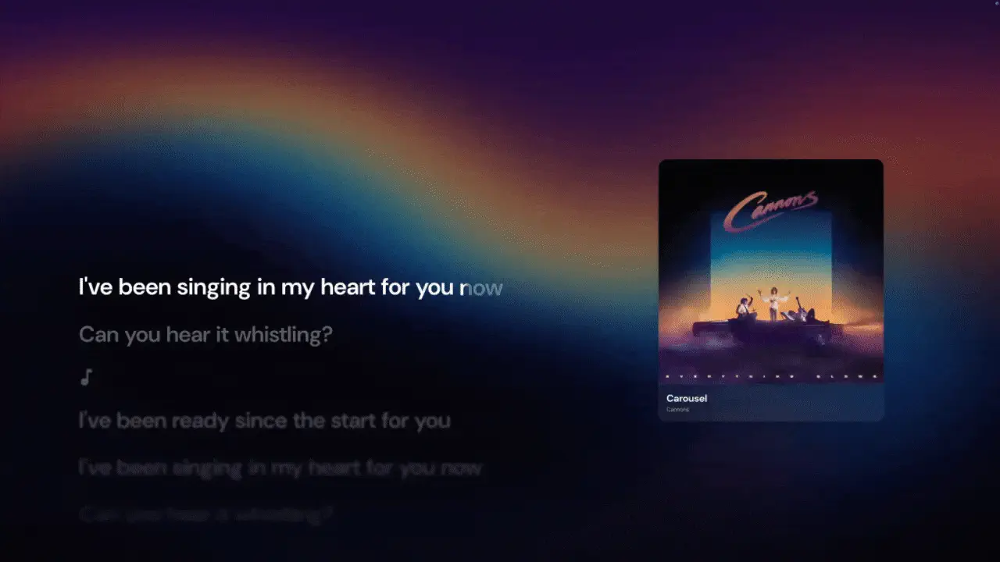
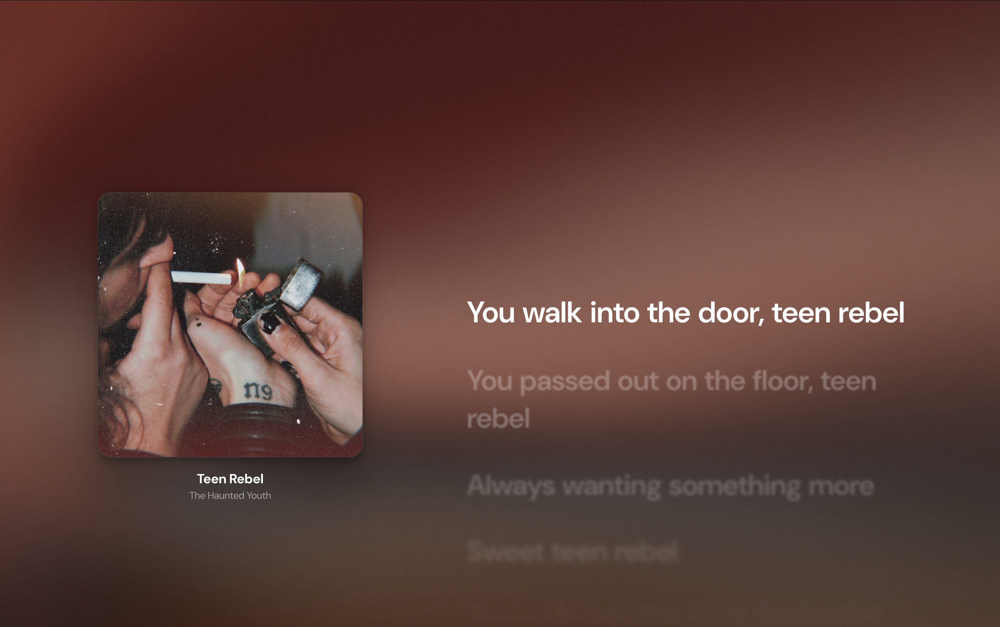

# Sustain

A calm, minimal BetterLyrics theme built to disappear into the music.

## Installation

1. Open Better Lyrics extension options
2. Go to **Themes** tab
3. Browse the theme store and install directly, or click **Install from URL** and enter: `https://github.com/better-lyrics/theme-sustain`

## Preview

## License

MIT
